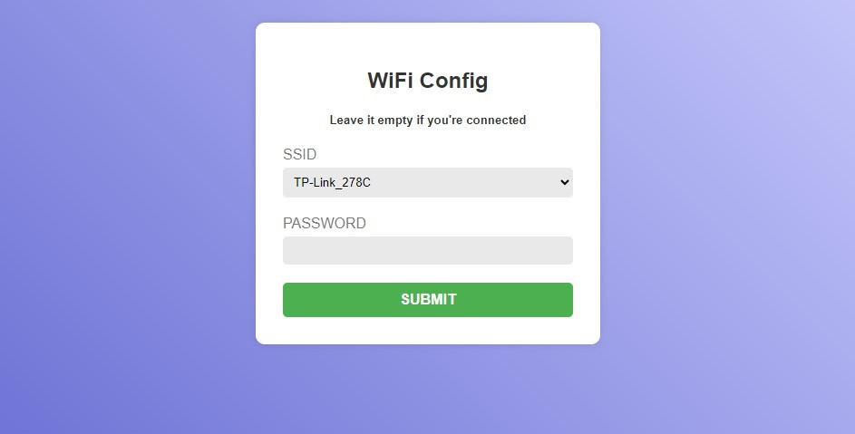

# WIFI MANAGER (MicroPython)
Simple WIFI MANAGER MicroPython script for Micro-Controllers (Raspberry Pi Pico W - ESP32...).
  
Possibility to connect to the Wi-Fi network saved in the wifi_credentials.json file or create an Access Point to configure the device's Wi-Fi connection from another device.
  
Stores the last 5 Wi-Fi connections
  
In the "connect_wifi" function, it scans the available networks and checks the signal quality to connect to the best option previously stored
  
Auto-Reset from AP Mode after 120 seconds
  
Nice and clen interface using HTML - CSS - JS to establish the connection on your device.
 
Modify the config_page.html file to adapt it to your needs
  

## INSTALL
Configure your device using Thonny for example.
 
Copy the script to your device (Raspberry Pi Pico W - ESP32...)

Use the following functions:

## Import WifiManager
    import wifimanager
    
## Connect to Wifi
    wifimanager.connect_wifi()

## Create Access Point
    wifimanager.ap_mode()

You can use these methods in different ways.
 
For example, as you can see in the **boot.py** file, you can boot your device and try to connect to the previously stored Wifi network (wifi_credentials.json), if the connection fails it will open the ap mode automatically.
  
Look at the Log and you will see the different configuration states.
  
If you have a TFT screen or similar (IE.- ili9341), you can display the connection status on the screen using the corresponding drivers from the manufacturer.
